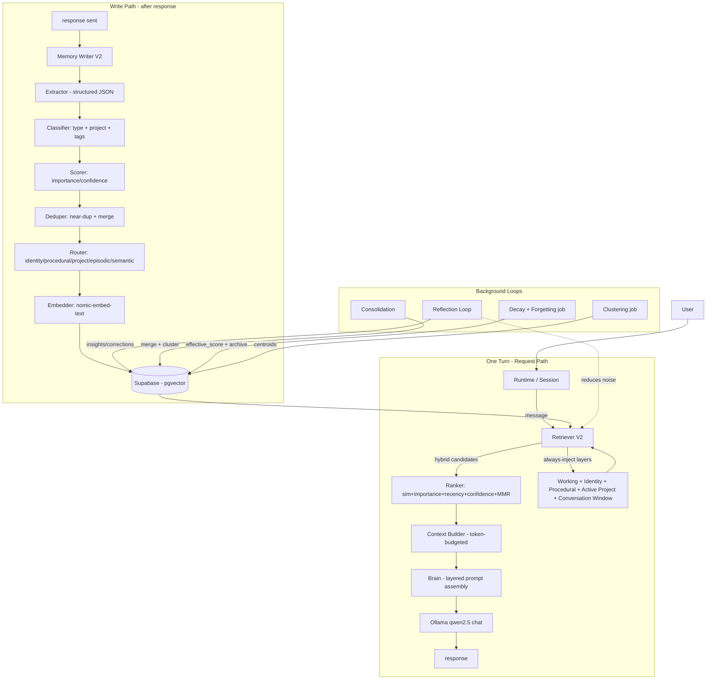
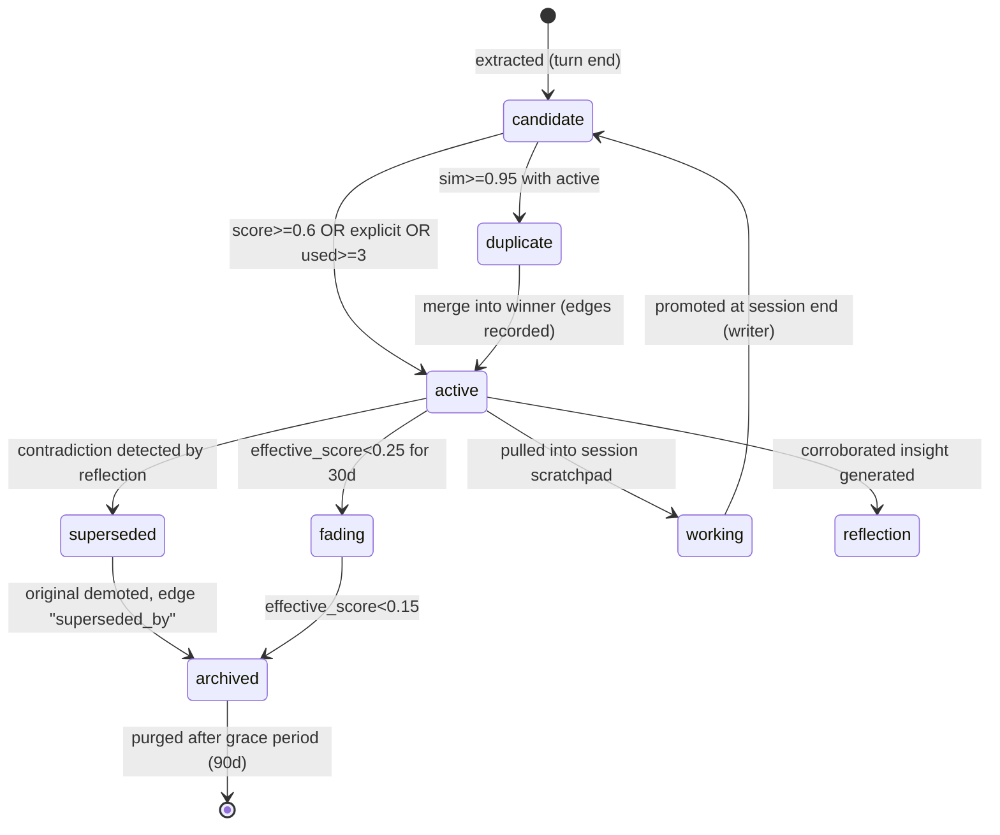

# AETHER MEMORY V2 — Architecture Specification

**Scope:** Complete redesign of the memory system. Audit → Design → 10 deliverables. No application code is written in this document; SQL schema DDL is included because it *is* deliverable #3, not implementation code.

---

## PART 0 — COMPLETE AUDIT OF THE CURRENT MEMORY SYSTEM

### 0.1 What exists today (verified against source)

| Area | File(s) | State |
|---|---|---|
| Chat entry | `app/api/chat/route.ts` | Auth → `Runtime` → `runPipeline()` |
| Runtime | `lib/core/runtime.ts`, `lib/core/types.ts` | Stateless bag: `{userId, message, context, prompt, response}` |
| Pipeline | `lib/core/pipeline.ts` | `buildContext` → `buildBrain` → `saveUserMessage` → `chat` → `saveAssistantMessage` |
| Context | `lib/context/builder.ts` | Parallel fetch of identity, memories, knowledge, planner |
| Brain | `lib/brain/brain.ts` | One prompt; context JSON-dumped verbatim |
| Embeddings | `lib/ai/embeddings/embed.ts` | Direct Ollama call (nomic-embed-text) — bypasses provider registry |
| Provider | `lib/ai/providers/ollama.ts` | qwen2.5:3b chat, nomic-embed-text embed; `OllamaProvider.embed()` is unused dead code |
| Retriever | `lib/memory/retrieve.ts` | `embed(message)` → RPC `match_memories` → top 8 → increments `times_used` |
| Repository | `lib/repositories/memory.repository.ts` | `match_memories`, `insertMemory`, `updateMemoryById`, title lookup, usage increment |
| Writers | `lib/memory/memory.ts`, `upsertMemory.ts` | **Never called anywhere** |
| Extractors | `lib/memory/extractor.ts` (regex), `aiExtractor.ts` (LLM) | **Never called anywhere** |
| Identity | `lib/identity/*` | `extractIdentity` never called; `saveIdentityFacts` only used in profile/setup page |
| Conversation | `lib/ai/conversation/*` | `messages` table, unbounded history |
| Knowledge | `lib/knowledge/*` | Non-vector table, `ilike` search only |
| Planner | `lib/planner/*` | `buildPlan`/`parsePlanningMessage` never called; no writer path |
| DB schema | **No SQL exists in repo** | Schema lives only in the Supabase cloud project (`supabase/migrations/` absent) |

### 0.2 The actual runtime flow today

```
User
 ↓
/api/chat POST
 ↓
Runtime(userId, message)
 ↓
buildContext()
   ├─ getIdentity()          → profiles table (flat columns)
   ├─ retrieveMemories()     → embed(message) → RPC match_memories → top 8 → write-back times_used
   ├─ retrieveKnowledge()    → knowledge table (all rows, ilike)
   └─ retrievePlanner()      → goals/projects/milestones/tasks (all rows)
 ↓
buildBrain()  → single prompt: JSON.stringify(context.*) + "never invent" rules
 ↓
OllamaProvider.chat(messages = [system(prompt), ...ALL history])
 ↓
saveAssistantMessage()
```

### 0.3 Verified gaps against your problem list

| Claimed problem | Verification |
|---|---|
| "retrieval works" | ✅ True. `retrieveMemories` → `match_memories` RPC is live and used by the context builder. |
| "no learning" | ✅ **Confirmed.** `saveMemory`, `upsertMemory`, `aiExtractMemories`, `extractMemories` are exported but have **zero call sites**. The system is read-only: it retrieves but never writes from conversation. |
| "no consolidation" | ✅ Absent. No clustering, no merge logic, no hierarchy. |
| "no importance" | ✅ Absent. `importance` column does not exist. |
| "no forgetting / no decay" | ✅ Absent. `times_used`/`last_used` exist but are never used to score, prune, or demote. |
| "duplicate memories" | ✅ Likely. Dedup is by exact `title` match only; the LLM extractor would emit near-duplicate titles; it's not even wired. |
| "no semantic clustering" | ✅ Absent. No cluster table, no batch job. |
| "no episodic / procedural / working / reflection" | ✅ Absent. `lib/ai/memory` and `lib/ai/chat` are **empty directories**. |
| "no confidence / no source tracking" | ✅ Absent. Only a `role` column (`user/assistant/system`). |
| "no memory updates" | ✅ Absent. Only `updateMemoryById(content, embedding)` on exact-title match. |

### 0.4 Additional defects found in audit (must fix regardless of V2)

1. **Schema is not under version control.** There is no `supabase/migrations/` and no `.sql` file in the repo. The `match_memories` function + `memories` table exist only in the cloud. This is the #1 production risk.
2. **Conversation window is unbounded.** `getHistory()` loads every message ever, then unshifts the full brain prompt. With `num_ctx: 2048` this guarantees context overflow within a few turns.
3. **Embedding an empty string on `/memory` page.** `app/memory/page.tsx` calls `retrieveMemories(user.id, "")` → cosine against empty vector returns junk.
4. **Write amplification on read path.** `retrieveMemories` does one `UPDATE` per memory per turn instead of a batch.
5. **Duplicate embedding paths.** `lib/ai/embeddings/embed.ts` and `OllamaProvider.embed()` both exist; the provider method is dead.
6. **Hardcoded Ollama URLs/models** in 3 places; no config.
7. **`setAll(){}` empty** in `lib/supabase/server.ts` → session refresh cookies are dropped.
8. **Junk/duplicate files at repo root** (`pipeline.txt`, `route.txt`, `manager.txt`, `runtime-types.txt`, `c --noEmit`, `ersPiyushaether-v2`, etc.) — debug output committed to git.
9. **Repo rule conflict:** `CLAUDE.md` says *"Never create v2, new, copy, or duplicate files"* — the V2 redesign must **replace `lib/memory` in place**, not fork it.
10. **No feedback loop.** Nothing records whether the user accepted/corrected AI statements.

### 0.5 Audit verdict

The current system is a **read-only vector search stub**, not a memory system. It has the correct skeleton (Runtime → Pipeline → Context → Brain, Supabase + pgvector + Ollama) but zero write path, zero lifecycle, zero learning. It must be **redesigned, not patched** — which is exactly what follows.

---

## PART 1 — DESIGN FUNDAMENTALS (decisions that shape everything)

### 1.1 Principles

1. **One canonical memory record, eight views.** Every persistent memory is a row in `memories`, discriminated by `memory_type`. Layers are *policies* (retention, decay, injection) applied to a type — not separate databases.
2. **Two paths, always separated.** **Read path** (query → ranked context) and **Write path** (turn → extraction → scoring → dedupe → persist) never block each other. Writes happen **after** the response is sent.
3. **Everything is scored, everything decays.** No memory is eternal. Identity is near-eternal but still has a confidence floor.
4. **Every mutation is an auditable event.** `memory_events` + `memory_edges` give full source/derivation tracing.
5. **The model is a grader, not a source of truth.** Extraction/reflection use the LLM; verification uses similarity + user feedback + repeated corroboration.
6. **Token budget is a first-class constraint.** Context injection is ranked, truncated, and formatted under a hard budget.

### 1.2 Layer map (the 8 layers)

| # | Layer | Storage | `memory_type` | Lifecycle | Retention | Injection policy |
|---|---|---|---|---|---|---|
| 1 | Working | In-memory session store (Redis in prod) | `working` | ephemeral, TTL=session | session | always, first |
| 2 | Conversation | `messages` table + rolling summary | `conversation` | append-only, windowed | window+summary | last N turns + summary |
| 3 | Long-term (semantic) | `memories` + pgvector | `semantic` | candidate→active→fading→archived | decaying | hybrid retrieval |
| 4 | Identity | `memories` + `profiles` mirror | `identity` | near-stable, confirmation-gated | ~permanent | always (capped) |
| 5 | Procedural | `memories` | `procedural` | reinforced by usage | slow decay | always (capped) |
| 6 | Project | `memories` (project_id) + `projects` | `project` | bound to project status | project lifetime | active project always, others on demand |
| 7 | Episodic | `memories` | `episodic` | high initial importance, fast decay | short | recency-gated |
| 8 | Reflection | `memories` | `reflection` | promoted by corroboration | medium | triggered/boosted on query |

### 1.3 Canonical memory record (the schema contract)

```
id            uuid            PK
user_id       uuid            FK auth.users
project_id    uuid            NULL FK projects
memory_type   enum            semantic|identity|procedural|project|episodic|reflection|conversation|working
status        enum            candidate|active|fading|archived|deleted
title         text            short, human-readable
content       text            verbatim detail
summary       text            compressed form (used when token budget is tight)
importance    numeric(3,2)    0..1 composite importance
confidence    numeric(3,2)    0..1 extractor+feedback confidence
embedding     vector(768)     nomic-embed-text, null until embedded
source        enum            user|assistant|system|extractor|reflection|consolidation|import|merge
source_ref    text            message id / URL / file line / cluster id
tags          text[]
metadata      jsonb           type-specific: occurred_at, half_life, model, cluster_id, ...
times_used    int             retrieval count
last_used     timestamptz     last retrieval
last_scored   timestamptz     last decay recompute
effective_score numeric(4,3)  current decayed score (retrieval uses this)
created_at    timestamptz
updated_at    timestamptz
```

---

## DELIVERABLE 1 — ARCHITECTURE DIAGRAM

### 1A. System-level diagram



### 1B. Memory lifecycle state diagram



## DELIVERABLE 2 — FOLDER STRUCTURE

`lib/memory` is **replaced in place** (respecting the CLAUDE.md rule against `-v2` forks). Old `lib/memory/*` files are deleted; `lib/repositories/memory.repository.ts` is split into typed repository modules under `lib/memory/`.

```
lib/memory/
  index.ts                    # public API surface (retrieve + write + lifecycle entry points)
  types.ts                    # MemoryRecord, enums, retrieval/reflection contracts
  constants.ts                # weights, thresholds, half-lives, budgets (single source of truth)
  score.ts                    # importance(), retrievalScore(), decayFactor(), effectiveScore()
  logger.ts                   # structured memory-event logger (wraps memory_events)

  working/
    store.ts                  # WorkingMemoryStore interface
    memoryStore.ts            # in-process Map impl (single-instance dev)
    redisStore.ts             # Redis impl (production; swapped via interface)

  extract/
    extractor.ts              # LLM structured extraction (schema-validated JSON)
    classifier.ts             # memory_type + project_id + tags + explicit-flag
    fallback.ts               # regex tier for model-down (current extractor.ts logic)

  write/
    writer.ts                 # orchestrates: capture → extract → score → dedupe → route → embed → persist
    dedupe.ts                 # near-duplicate scan + merge decision
    router.ts                 # type → destination (identity mirror, project attach, working flush)
    embedder.ts               # embedMemory(title+content+summary) with dimension guard

  read/
    retriever.ts              # hybrid retrieval orchestrator (query→candidates→rank→budget)
    vector.ts                 # pgvector RPC client (match_memories_v2)
    keyword.ts                # tsvector/full-text candidate source
    layerSources.ts           # always-inject sources (identity, procedural, active project, working)
    rerank.ts                 # composite scoring + MMR diversity
    budget.ts                 # token budget allocation + truncation

  lifecycle/
    lifecycle.ts              # promote/demote/archive/forget transitions
    decay.ts                  # batch decay recompute
    consolidation.ts          # cluster→merge job
    forgetting.ts             # archive purge + hard delete
    supersede.ts              # contradiction handling (edges, demotion)

  reflection/
    reflection.ts             # triggers, prompt assembly, output apply
    correction.ts             # apply suggested updates/merges with safety gates

  clustering/
    clustering.ts             # K-means/agglomerative batch job per user
    memberships.ts            # cluster_id assignment + centroid refresh

  conversations/
    window.ts                 # last-N-turns windowing
    summarize.ts              # rolling LLM summary of old turns

  repositories/
    memory.repo.ts            # CRUD + RPC wrappers for memories
    event.repo.ts             # memory_events
    edge.repo.ts              # memory_edges
    cluster.repo.ts           # memory_clusters

app/api/
  chat/route.ts               # pipeline + after(() => runWritePath())   [modified]
  memories/route.ts           # GET list/filter, POST manual memory        [new]
  memories/[id]/route.ts      # PATCH (confirm/correct/delete)             [new]
  sessions/[id]/route.ts      # session end → flush working + reflect      [new]
  jobs/route.ts               # admin-triggered: decay/consolidate/cluster [new]

lib/core/
  runtime.ts                  # + sessionId, workingMemory, retrievalTrace [modified]
  pipeline.ts                 # split pre/post turn                        [modified]
  types.ts                    # + WorkingMemory, RetrievalTrace, TurnRecord[modified]

lib/brain/brain.ts            # layered prompt assembly + budget           [modified]
lib/context/builder.ts        # uses retriever.v2, not raw retrieveMemories[modified]
lib/ai/providers/ollama.ts    # single source of chat+embed; config-driven [modified]
lib/identity/store.ts         # mirrored writes from identity router       [modified]

supabase/migrations/          # NEW - schema version control (see deliverable 4)
  0001_memory_v2_enums.sql
  0002_memory_v2_tables.sql
  0003_memory_v2_indexes.sql
  0004_memory_v2_rpcs.sql
  0005_memory_v2_backfill.sql
```

## DELIVERABLE 3 — DATABASE SCHEMA (Supabase + pgvector)

Model contract: **one `memories` table + 3 auxiliary tables** (`memory_clusters`, `memory_edges`, `memory_events`) + existing `messages`/`profiles`/`projects` extended. All DDL below is additive-safe (Phase 1 migration).

```sql
-- ============ 0002_memory_v2_tables.sql ============

create type memory_type as enum
  ('semantic','identity','procedural','project','episodic','reflection','conversation','working');

create type memory_status as enum
  ('candidate','active','fading','archived','deleted');

create type memory_source as enum
  ('user','assistant','system','extractor','reflection','consolidation','import','merge');

alter table memories add column if not exists memory_type memory_type not null default 'semantic';
alter table memories add column if not exists status       memory_status not null default 'candidate';
alter table memories add column if not exists summary      text not null default '';
alter table memories add column if not exists tags         text[] not null default '{}';
alter table memories add column if not exists importance   numeric(3,2) not null default 0.5;
alter table memories add column if not exists confidence   numeric(3,2) not null default 0.5;
alter table memories add column if not exists source       memory_source not null default 'extractor';
alter table memories add column if not exists source_ref   text;
alter table memories add column if not exists project_id   uuid references projects(id) on delete set null;
alter table memories add column if not exists metadata     jsonb not null default '{}';
alter table memories add column if not exists last_scored  timestamptz not null default now();
alter table memories add column if not exists effective_score numeric(4,3) not null default 0.5;

create table memory_clusters (
  id             uuid primary key default gen_random_uuid(),
  user_id        uuid not null references auth.users(id) on delete cascade,
  centroid       vector(768) not null,
  label          text,
  member_count   int not null default 0,
  avg_importance numeric(3,2) not null default 0,
  created_at     timestamptz not null default now(),
  updated_at     timestamptz not null default now()
);

alter table memories add column if not exists cluster_id uuid references memory_clusters(id) on delete set null;

create table memory_edges (
  id         uuid primary key default gen_random_uuid(),
  user_id    uuid not null references auth.users(id) on delete cascade,
  source_id  uuid not null references memories(id) on delete cascade,
  target_id  uuid not null references memories(id) on delete cascade,
  relation   text not null
             check (relation in ('merges_into','supersedes','consolidated_into',
                                 'derives_from','contradicts','related_to','source_of')),
  created_at timestamptz not null default now(),
  check (source_id <> target_id)
);

create table memory_events (
  id         bigint generated always as identity primary key,
  user_id    uuid not null references auth.users(id) on delete cascade,
  memory_id  uuid references memories(id) on delete set null,
  action     text not null,
  payload    jsonb,
  created_at timestamptz not null default now()
);

-- conversation layer support
alter table messages add column if not exists session_id uuid;
alter table messages add column if not exists token_count int not null default 0;

-- conversations (rolling summary holder)
create table conversations (
  id         uuid primary key default gen_random_uuid(),
  user_id    uuid not null references auth.users(id) on delete cascade,
  session_id uuid not null,
  summary    text not null default '',
  turn_count int not null default 0,
  started_at timestamptz not null default now(),
  updated_at timestamptz not null default now(),
  unique (user_id, session_id)
);

-- internal job queue for async heavy work (clustering/consolidation/reflection)
create table memory_jobs (
  id         uuid primary key default gen_random_uuid(),
  job_type   text not null,             -- 'decay'|'forget'|'consolidate'|'cluster'|'reflect'
  user_id    uuid null,                 -- null = global sweep
  status     text not null default 'pending',
  payload    jsonb,
  attempts   int not null default 0,
  last_error text,
  created_at timestamptz not null default now(),
  started_at timestamptz,
  finished_at timestamptz
);
```

```sql
-- ============ 0003_memory_v2_indexes.sql ============

-- vector index (HNSW preferred: high recall, live inserts; ivfflat fallback for small tables)
create index if not exists memories_embedding_hnsw_idx
  on memories using hnsw (embedding vector_cosine_ops)
  where status <> 'deleted';

create index if not exists memories_user_type_idx  on memories(user_id, memory_type);
create index if not exists memories_user_status_idx on memories(user_id, status);
create index if not exists memories_tags_idx       on memories using gin (tags);
create index if not exists memories_tsv_idx
  on memories using gin (to_tsvector('english', title || ' ' || content || ' ' || summary));
create index if not exists memories_effective_score_idx on memories(user_id, effective_score desc);
create index if not exists memories_project_idx    on memories(project_id) where project_id is not null;
create index if not exists memory_events_user_idx  on memory_events(user_id, created_at desc);
create index if not exists memory_edges_user_idx   on memory_edges(user_id, source_id);
create index if not exists memory_jobs_status_idx  on memory_jobs(status, created_at);
```

```sql
-- ============ 0004_memory_v2_rpcs.sql ============

-- Core hybrid vector retrieval.
create or replace function match_memories_v2(
  query_embedding vector(768),
  p_user_id       uuid,
  p_match_count   int default 30,
  p_min_similarity float default 0.65,
  p_types         text[] default null,
  p_statuses      text[] default array['active'],
  p_project_id    uuid default null
) returns table (
  id uuid, title text, content text, summary text, tags text[],
  memory_type text, importance numeric, confidence numeric,
  similarity float, effective_score numeric, times_used int, last_used timestamptz
) language plpgsql security definer as $$
begin
  if auth.uid() <> p_user_id then
    raise exception 'not authorized';
  end if;
  return query
  select
    m.id, m.title, m.content, m.summary, m.tags,
    m.memory_type::text, m.importance, m.confidence,
    1 - (m.embedding <=> query_embedding) as similarity,
    m.effective_score, m.times_used, m.last_used
  from memories m
  where m.user_id = p_user_id
    and m.embedding is not null
    and m.status::text = any(p_statuses)
    and (p_types is null or m.memory_type::text = any(p_types))
    and (p_project_id is null or m.project_id = p_project_id)
    and (1 - (m.embedding <=> query_embedding)) >= p_min_similarity
  order by similarity desc
  limit p_match_count;
end $$;

-- Near-duplicate detection for the deduper.
create or replace function find_near_duplicates(
  p_user_id uuid, p_embedding vector(768), p_threshold float default 0.85
) returns table (id uuid, title text, similarity float, memory_type text, status text)
language sql security definer stable as $$
  select m.id, m.title, 1 - (m.embedding <=> p_embedding) as similarity,
         m.memory_type::text, m.status::text
  from memories m
  where m.user_id = p_user_id
    and m.embedding is not null
    and m.status::text in ('active','fading')
    and 1 - (m.embedding <=> p_embedding) >= p_threshold
  order by similarity desc;
$$;

-- Decay sweep: recompute effective_score from importance + last_used (per type half-life).
create or replace function apply_memory_decay(p_user_id uuid default null)
returns int language plpgsql security definer as $$
declare n int := 0; half_life_days numeric;
begin
  for m in
    select * from memories
    where (p_user_id is null or user_id = p_user_id)
      and status in ('active','fading')
      and memory_type <> 'identity'
  loop
    half_life_days := case m.memory_type
      when 'episodic'   then 14
      when 'semantic'   then 180
      when 'procedural' then 365
      when 'project'    then 180
      when 'reflection' then 90
      when 'conversation' then 30
      when 'working'    then 1
      else 180 end;
    update memories
      set effective_score = round(
            (m.importance::float * 0.7
           + (case when m.last_used is null then 0.2
                   else 0.2 * exp(-ln(2) * extract(epoch from (now()-m.last_used))/86400 / half_life_days) end)
            )::numeric, 3),
          last_scored = now()
      where id = m.id;
    n := n + 1;
  end loop;
  return n;
end $$;
```

```sql
-- Forget: soft-delete archived rows past grace period, then hard-purge later.
create or replace function forget_archived(p_grace_days int default 90)
returns int language plpgsql security definer as $$
declare n int := 0;
begin
  update memories set status = 'deleted'
  where status = 'archived'
    and updated_at < now() - make_interval(days => p_grace_days)
    and memory_type not in ('identity','procedural');
  get diagnostics n = row_count;
  delete from memories where status = 'deleted'
    and updated_at < now() - make_interval(days => p_grace_days + 30);
  return n;
end $$;

-- Merge keep into mergees (dup + consolidation). Records edges + events.
create or replace function merge_memories(p_keep uuid, p_merge uuid[])
returns void language plpgsql security definer as $$
declare u uuid; keep_user uuid;
begin
  select user_id into keep_user from memories where id = p_keep;
  if auth.uid() <> keep_user then raise exception 'not authorized'; end if;

  foreach u in array p_merge loop
    insert into memory_edges(user_id, source_id, target_id, relation)
    values (keep_user, u, p_keep, 'merges_into');
    update memories set
      times_used = memories.times_used +
        (select m.times_used from memories m where m.id = u),
      tags = (select array(select distinct unnest(memories.tags || (select m.tags from memories m where m.id = u)))),
      updated_at = now()
    where id = p_keep;
    update memories set status = 'deleted' where id = u;
    insert into memory_events(user_id, memory_id, action, payload)
    values (keep_user, p_keep, 'merged', jsonb_build_object('from', u));
  end loop;
end $$;

-- updated_at trigger
create or replace function set_updated_at() returns trigger language plpgsql as $$
begin new.updated_at = now(); return new; end $$;
create trigger memories_updated_at before update on memories
  for each row execute function set_updated_at();
create trigger conversations_updated_at before update on conversations
  for each row execute function set_updated_at();
create trigger memory_clusters_updated_at before update on memory_clusters
  for each row execute function set_updated_at();

-- RLS
alter table memories enable row level security;
alter table memory_clusters enable row level security;
alter table memory_edges enable row level security;
alter table memory_events enable row level security;
alter table conversations enable row level security;
alter table memory_jobs enable row level security;

create policy memories_select on memories for select using (auth.uid() = user_id);
create policy memories_insert on memories for insert with check (auth.uid() = user_id);
create policy memories_update on memories for update using (auth.uid() = user_id);
create policy memories_delete on memories for delete using (auth.uid() = user_id);
-- (same 4 policies × clusters/edges/events/conversations; jobs: select/insert only)
```

**Embedding vector**: `vector(768)` = nomic-embed-text output dimension. Guard in code: reject/retry if embedding length ≠ 768 (the model can silently change output dims across versions).

---

## DELIVERABLE 4 — MIGRATION PLAN

Guiding rule: **additive-first, cutover-last**. The app keeps running on the old path until V2 passes acceptance.

| Phase | Name | Action | Breakage | Rollback |
|---|---|---|---|---|
| **P0** | Schema version control | Run `supabase init` + `supabase db pull` to snapshot the cloud schema into `supabase/migrations/0000_baseline.sql`. Remove `setAll(){}` cookie bug. | none | n/a |
| **P1** | Additive schema | Apply enums, new columns (all `default`-ed), `memory_clusters/edges/events/conversations/memory_jobs`, indexes, RPCs (new names only — do **not** alter `match_memories`). | none | `supabase migration down`; old code untouched |
| **P2** | Backfill | One-off script: classify every existing `memories` row → `memory_type` (title-keyword + LLM batch), set `importance=0.5`, `confidence=0.5`, `status='active'`, `source='import'`, recompute `summary`, embed `content` if missing. | none | re-run idempotently |
| **P3** | Dual-run | Ship **new retriever + writer** behind feature flag `MEMORY_V2=true`. Read path compares V1 vs V2 candidate sets; log diffs to `memory_events`. Writes go to V2 tables only. | none | flip flag off |
| **P4** | Cutover | Default flag on; delete old retriever/writer files; drop obsolete columns (`role` on memories stays for compat or is dropped last); archive `match_memories` RPC (keep for fallback). | controlled | keep old RPCs for 1 release |
| **P5** | Continuous jobs | Schedule `apply_memory_decay`, `forget_archived`, clustering, consolidation via `pg_cron` (or app-level scheduler in `instrumentation.ts`). Wire reflection triggers. | none | cron off |
| **P6** | Data cleanup | Purge `messages` older than window (after summary capture); remove root debug/junk files; clean console.log noise. | none | backups |

**Sizing note**: at current scale (single user, hundreds of memories), HNSW index build is instant. For multi-tenant growth, partition `memories` by `user_id` when row count exceeds ~10M, or shard by user hash.

## DELIVERABLE 5 — PIPELINE CHANGES

### 5.1 Runtime (`lib/core/types.ts`)

```ts
RuntimeState += {
  sessionId: string,          // from cookie or client-generated
  workingMemory: WorkingMemory,
  retrievalTrace: RetrievalTrace[],  // what was injected & why (debug/UI)
  turnId: string,
}
```

### 5.2 Split pipeline — Pre-turn (blocking) vs Post-turn (write-behind)

```
POST /api/chat
 ├─ auth (supabase.getUser)
 ├─ create Runtime {userId, message, sessionId}
 ├─ Pre-turn (runPipelinePre):
 │    working = workingStore.get(sessionId)
 │    retrieval = retriever.retrieve(userId, message, {working, sessionId})
 │    conversation = conversation.window(sessionId, lastN=20) + rolling summary
 │    context = buildContext(userId, retrieval, conversation)
 │    prompt = brain.build(context)         // layered, token-budgeted
 │    response = provider.chat([system(prompt), ...conversation])
 ├─ saveAssistantMessage()
 └─ Post-turn (runPipelinePost) — INSIDE Next.js after():
      after(async () => {
        await writer.run(userId, sessionId, {userMsg, assistantMsg, retrieval})
        await touchDecay(userId, retrievedIds)        // batch, not per-row
        if (shouldReflect(turnCount)) await reflection.trigger(userId, sessionId)
      })
```

`after()` from `next/server` is the correct Next.js 16 mechanism (stable, runs after response even on error, supported in Route Handlers). Route `maxDuration` must be raised (e.g., 60s) so write-path + reflection finish; heavy jobs (clustering/consolidation) go through `memory_jobs` + cron, never the request.

### 5.3 Conversation memory fix (required)

`getHistory()` is replaced by `conversation.window(sessionId)`: last 20 turns + `conversations.summary` of everything older. `num_ctx` must be raised to 8192 and config-driven.

### 5.4 Brain prompt v2

Replace JSON dumps with structured, labeled sections under a hard budget:

```
[IDENTITY]      ≤ 500 tokens   — always
[PROCEDURAL]    ≤ 600 tokens   — always (behavior rules)
[PROJECT]       ≤ 800 tokens   — active project
[WORKING]       ≤ 300 tokens   — session scratchpad
[MEMORIES]      ≤ 800 tokens   — ranked retrieval (summary-first)
[EPISODIC]      ≤ 400 tokens   — if query is temporal
[REFLECTIONS]   ≤ 300 tokens   — relevant insights only
[RULES]         static
TOTAL MEMORY CAP ≈ 3700 tokens; hard ceiling enforced by budget.ts
```

Each injected memory is rendered as `[title | type | confidence] summary` — never full content unless selected.

## DELIVERABLE 6 — RETRIEVER REDESIGN

### 6.1 Stages (all in `lib/memory/read/`)

**Stage 1 — Query understanding**
- `embed(query)` → `vector(768)`.
- Keyword extraction (title/content/summary/tags → tsquery) for the full-text leg.
- Type hint: classify query intent (identity? procedural? past-event? project?) — cheap classifier or LLM-lite; used to reweight layer boost.

**Stage 2 — Candidate generation (parallel, one query)**
- `match_memories_v2(query_embedding, user, 30, 0.65, types=null, statuses=['active'])` — semantic leg.
- Full-text leg: `ts_rank(tsv, query) LIMIT 20` (keyword recall for proper nouns, names, code identifiers that embeddings miss).
- Always-inject leg: Identity (top 50 by confidence), Procedural (top 30), Active Project block, Working memory — fetched directly, bounded, cached for session.
- Episodic leg: only when intent is temporal; filter `last_used`/`occurred_at` recency window.

**Stage 3 — Fusion + rerank**
```
retrieval_score = 0.50·similarity_norm
                + 0.15·importance
                + 0.10·recency_factor(decay per type half-life)
                + 0.10·confidence
                + 0.05·type_weight(intent match bonus)
                + 0.05·usage_factor(log1p(times_used))
                + 0.05·explicit_boost(if query mentions "remember/you told me")
```
Then **MMR** for diversity: `λ·score − (1−λ)·maxSimToSelected`, λ≈0.7, so one cluster can't dominate.

**Stage 4 — Budget + format**
- Allocate per-layer caps; drop lowest-ranked over-budget items; prefer `summary` over `content`; emit structured injection payload + `retrievalTrace` (memory ids, scores, source leg) for the `/memory` debug UI.

### 6.2 Retrieval-side side effects (batched)
- `times_used += 1`, `last_used = now()` via **one** batched RPC for all injected memories (kills the current write-amplification bug).

### 6.3 Layer weight matrix (defaults in `constants.ts`)

| memory_type | sim weight | recency half-life | always-inject cap |
|---|---|---|---|
| identity | 0.30 | 3650d | 50 |
| procedural | 0.40 | 365d | 30 |
| project | 0.50 | 180d | active-only |
| semantic | 0.55 | 180d | — |
| episodic | 0.45 | 14d | — |
| reflection | 0.45 | 90d | — |

## DELIVERABLE 7 — WRITER REDESIGN

Orchestrated by `lib/memory/write/writer.ts`, runs entirely in `after()`:

```
writer.run(userId, sessionId, turn)
  1. CAPTURE    → conversation.window appends (userMsg, assistantMsg); update token_count
  2. EXTRACT    → LLM structured JSON (schema-validated, zod):
                   [{title, content, summary, memory_type, importance(1-10), confidence(0-1),
                     explicit(bool), tags[], project_ref?}]
                   - system prompt = strict extractor (reuse+upgrade aiExtractor.ts)
                   - fails closed: invalid JSON → [] ; model down → regex fallback tier
  3. CLASSIFY   → resolve project_id (against active projects / user's `projects`),
                   normalize tags, override memory_type by rule (e.g., "remember I prefer" → procedural)
  4. SCORE      → importance = formula in §B5; effective_score init
  5. DEDUPE     → find_near_duplicates(p_embedding, 0.85):
                   sim ≥ 0.95            → merge (merge_memories), keep higher-importance winner
                   sim ≥ 0.88, same type → update winner (append evidence, bump confidence), edge 'merges_into'
                   sim ≥ 0.80            → keep both, add edge 'related_to' (review candidate)
  6. ROUTE      → identity   → Identity Memory + sync profiles mirror (needs confirmation gate)
                   procedural → Procedural Memory (only if explicit OR corroborated ≥2×)
                   project    → attach to project_id
                   episodic   → metadata.occurred_at = now(); high importance, fast decay
                   else       → semantic
  7. EMBED      → embedder.embed(title + "\n" + content + "\n" + summary) — dim guard 768
  8. PERSIST    → upsert; write memory_events('created'/'updated'/'merged'); return trace
```

**Confirmation gate for identity**: new identity facts are written as `candidate`; they become `active` only when (a) user confirms in UI (`PATCH /api/memories/[id]`), or (b) the same fact is re-stated 2+ times, or (c) confidence ≥ 0.9 AND no contradiction. The reflection loop proposes demotions for contradicted identity facts.

**Manual path**: `/api/memories` POST (user types "remember X"), `/api/memories/[id]` PATCH (confirm/correct/delete) — both funnel through the same dedupe/router so there is exactly one write path.

<!-- CHUNK_L_END -->
